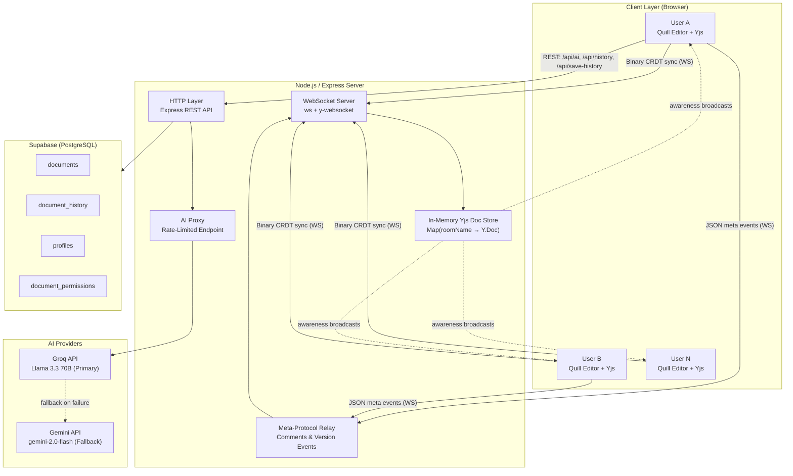

<div align="center">
  <h1>CoDoc</h1>
  <p><strong>Real-Time Collaborative Text Editor powered by CRDTs and AI</strong></p>

  [](https://nodejs.org/)
  [](https://github.com/yjs/yjs)
  [](https://developer.mozilla.org/en-US/docs/Web/API/WebSocket)
  [](https://supabase.com/)
  [](https://quilljs.com/)
</div>

<br />

CoDoc is a production-ready, real-time collaborative text editor that allows multiple users to edit the same document simultaneously. Built for a Hackathon submission, it satisfies and exceeds core requirements by leveraging **Conflict-Free Replicated Data Types (CRDTs)** via Yjs for mathematically guaranteed consistency, eliminating the bottlenecks of centralized Operational Transformation (OT) servers.

---

## Submission Links

| Resource | Link |
|---|---|
| Live Demo | [https://codoc-g086.onrender.com](https://codoc-g086.onrender.com) |
| GitHub Repository | [https://github.com/tanusree-k/CoDoc](https://github.com/tanusree-k/CoDoc) |
| Video Demo | [https://drive.google.com/file/d/1TFMuJStrGQ4ZCQLHLgPaWkbnObuX8Lvp/view?usp=drivesdk](https://drive.google.com/file/d/1TFMuJStrGQ4ZCQLHLgPaWkbnObuX8Lvp/view?usp=drivesdk) |

---

## Table of Contents

- [Key Features](#key-features)
- [Architecture](#architecture)
- [Tech Stack](#tech-stack)
- [AI Integrations](#ai-integrations)
- [Setup Instructions](#setup-instructions)
- [Scoring Rubric Alignment](#scoring-rubric-alignment)
- [Known Limitations](#known-limitations)

---

## Key Features

| Feature | Description |
|---|---|
| Real-time Synchronization | Changes are instantly propagated across all connected clients with sub-millisecond local latency. |
| User Presence | Active collaborators are displayed with custom avatars and live active/inactive statuses. |
| Cursor Tracking | Each user receives a unique, color-coded cursor reflecting their live selection position. |
| Conflict Resolution | Powered by **Yjs** CRDT, guaranteeing eventual consistency even across offline/reconnect cycles. |
| Rich Text Formatting | Full Quill v2 toolbar: bold, italic, lists, code blocks, alignment, blockquotes, fonts, and sizes. |
| Revision History | All edits are debounced and persisted to PostgreSQL. Users can browse and restore prior versions. |
| AI Writing Assistant | Built-in AI chat with Groq (Llama 3) as primary and Gemini as automatic fallback. |
| Collaborative Comments | Users can anchor threaded comments to specific text ranges without disrupting document content. |
| Role-Based Access Control | Documents support Owner, Editor, Commenter, and Viewer permission levels. |
| Image Insertion | Drag-and-drop or file-picker image upload with client-side crop and compression via Cropper.js. |
| Export | One-click export to HTML, PDF, or Plain Text. |

---

## Architecture

CoDoc uses a **decentralized state synchronization model** backed by a centralized relay server. Rather than a server arbitrating all operations (as in OT), each client independently maintains a full CRDT state. The server's role is limited to relaying binary state vectors between peers and persisting document content.

### System Diagram



### Connection Lifecycle

1. **Connection** — A client opens a WebSocket to the Node.js server for a specific `roomName` (document ID).
2. **Initial Sync** — The server immediately sends a Yjs Sync Step 1 message and broadcasts current awareness states. The client responds with missing deltas.
3. **Editing** — As the user types, Yjs encodes inserts and deletes as binary update packets. These are forwarded to all peers in the same room in real-time.
4. **Awareness** — Cursor positions and user presence are broadcast as ephemeral binary awareness packets, fully decoupled from document data.
5. **Comments/Versions** — Non-editor events (comments, version notifications) travel over the same WebSocket connection as JSON messages via a secondary meta-protocol.
6. **Persistence** — The client debounces its local state to HTML and pushes autosaves to Supabase via the REST API, capping history at 20 versions per user per document.

### Frontend Module Structure

```
src/
├── editor.js        # Core: Quill + Yjs binding, toolbar, image upload, export
├── ai-chat.js       # AI chat panel, prompt handling, content injection
├── comments.js      # Comment anchoring, sidebar rendering, sync
├── history.js       # Version history fetch, render, and restore
├── sharing.js       # Role-based sharing UI and permission management
├── export.js        # HTML, PDF, and plain-text export
├── theme.js         # Dark/light mode toggle
└── utils.js         # Shared utility helpers
```

---

## Tech Stack

### Frontend

| Technology | Role |
|---|---|
| Vanilla JS (ES Modules) | Core application logic, no framework overhead |
| Quill v2 | Rich text editor engine |
| Yjs | CRDT document state management |
| y-quill | Yjs-to-Quill binding |
| quill-cursors | Renders remote user cursors in the editor |
| esbuild | Fast module bundler for production output |
| Cropper.js | Client-side image crop and compression |

### Backend

| Technology | Role |
|---|---|
| Node.js / Express | HTTP server, static file serving, REST API |
| `ws` | WebSocket server for CRDT binary relay |
| `y-protocols` | Yjs sync and awareness protocol implementation |
| express-rate-limit | Rate limiting on AI and write endpoints |

### Database (Supabase / PostgreSQL)

| Table | Purpose |
|---|---|
| `documents` | Document metadata (title, owner, timestamps) |
| `document_history` | Versioned HTML snapshots of document content |
| `profiles` | User profile data (username, avatar color) |
| `document_permissions` | Per-user role assignments (Owner / Editor / Commenter / Viewer) |

Row-Level Security (RLS) policies are applied to all tables to enforce user-level data isolation.

### Infrastructure & Tools

| Technology | Role |
|---|---|
| Render | Cloud deployment platform hosting the Node.js / WebSocket relay server |
| Antigravity | Advanced agentic IDE used for autonomous pair-programming and architecture design |

---

## AI Integrations

CoDoc utilizes two LLM providers to maximize availability:

**Groq API — `llama-3.3-70b-versatile` (Primary)**
The main provider for the built-in AI Writing Assistant. Selected for extremely low inference latency. Supports multi-style rephrasing (Formal, Casual, Shorten, Elaborate), summarization, and translation.

**Google Gemini API — `gemini-2.0-flash` (Automatic Fallback)**
Used whenever Groq is unavailable or rate-limited. The failover is handled server-side and is transparent to the user, ensuring the AI assistant remains operational at all times.

All AI requests are routed through the server-side `/api/ai` endpoint, which enforces a rate limit of 15 requests per IP per minute.

---

## Setup Instructions

### Prerequisites

- Node.js v18 or higher
- A [Supabase](https://supabase.com/) project with the schema initialized using `setup.sql`
- API keys for Groq and Google Gemini

### Installation

**1. Clone the repository**

```bash
git clone https://github.com/tanusree-k/CoDoc.git
cd CoDoc
```

**2. Install dependencies**

```bash
npm install
```

**3. Configure environment variables**

Create a `.env` file in the project root:

```env
SUPABASE_SERVICE_ROLE_KEY=your_supabase_service_role_key
GEMINI_API_KEY=your_gemini_api_key
GROQ_API_KEY=your_groq_api_key
```

**4. Initialize the database**

Run `setup.sql` and `create_history_table.sql` against your Supabase project to create all required tables and RLS policies.

**5. Start the development server**

```bash
npm run dev
```

This runs `esbuild` to bundle `src/editor.js` into `public/editor.bundle.js`, then starts the Node.js server.

**6. Access the application**

Open `http://localhost:3000` in your browser.


## Known Limitations

**WebSocket Message Volume**
Yjs awareness broadcasts a packet on every cursor movement and keystroke. Heavy multi-tab testing on free-tier platforms can exhaust message quotas quickly. A debouncing strategy on awareness updates is recommended for production scale.

**No Offline Persistence (IndexedDB)**
There is currently no local IndexedDB persistence layer. If the WebSocket disconnects and the tab is closed before a debounced autosave completes, recent local changes may not be recoverable.

**Cold Start Latency**
The project is hosted on Render's free tier, which spins down idle processes. Expect an initial load delay of approximately 50 seconds after a period of inactivity.

**Mobile Viewport**
The editor targets desktop viewport widths. The formatting toolbar and version history sidebar may not render optimally on narrow mobile screens.

---

<div align="center">
  <p><em>Built for real-time collaboration.</em></p>
</div>
